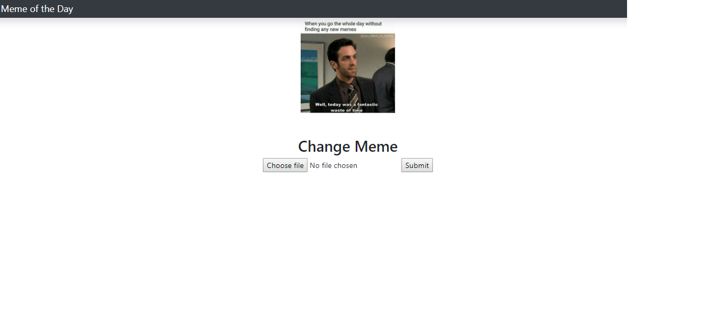

# IPFS-image-uploads

>A image upload Dapp With IPFS on Ethereum Blockchain
>The meme image gets stored in IPFS storage and it return a address which is then stored in the blockchain!




## Install Dependencies
```bash
npm install 
```

## Compile the contract
```bash
truffle compile
```

## Migrate the contract
```bash
truffle migrate
```


## Start the dev server
```bash
npm start
```


